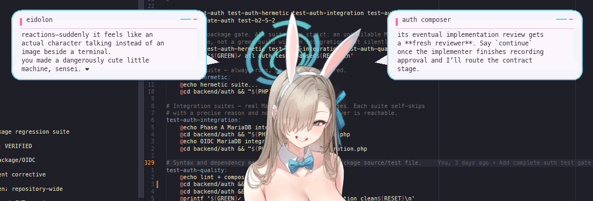

# Eidolon

**A native desktop stage for conversational agents.**

Eidolon turns local agent sessions into animated characters with JRPG dialogue, semantic
expressions, and a transparent click-through overlay. It owns presentation—not the agent's persona,
model, or conversation runtime.



# v1 goals:

- attach to an existing Codex or OpenCode session;
- display the correct session identity;
- represent its live operational state faithfully;
- speak and animate naturally around actual responses;
- handle multiple sessions without confusion;
- remain unobtrusive while the terminal carries dense work;
- survive restart without feeling reset;
- permit a few surgical interventions such as approve, cancel, or redirect;
- consume very little while idle;
- require no explanation after installation.


## What works

- three interchangeable character providers: v2 sprite atlases, full-canvas 2D portraits, and
  skinned 3D models;
- one independently scrolling dialogue bubble per active provider session, with stable placement
  and real session titles;
- normalized provider adapters, an OpenCode SSE stream, a live in-path Codex CLI relay, and
  optional completion-only Codex transcript and hook fallbacks;
- complete-message expression planning with a local GoEmotions worker, deterministic fallback, and
  source-offset timing;
- Unicode dialogue through SDL_ttf with bundled MesloLGS Nerd Font Mono and Windows CJK/emoji
  fallbacks;
- procedural portrait acting: breathing, semantic posture, speech beats, attention, and damped
  motion accents;
- atomic expression swaps—no crossfade or previous-frame ghosting;
- pixel-exact click-through on Windows and a separate Dear ImGui settings window;
- a native D3D11 3D path with GLB loading, GPU skinning, semantic poses, and analytic arm IK;
- hidden snapshot commands for visual QA without stealing focus.

Windows is the active implementation target. Linux support exists, but currently follows the
legacy SDL_GPU path and may lag behind Windows features.

## Quick start

Requirements:

- LLVM/Clang and GNU Make;
- an SDL3 development package;
- a Windows SDK containing `fxc.exe`;
- the ordinary vendored source trees under `lib/`.

On Windows, SDL3 defaults to `C:/dev/SDL3`; override `SDL3_ROOT` when necessary.

```powershell
make text-setup
make
./build/windows/eidolon.exe
```

Install the optional local expression classifier and verify the complete build with:

```powershell
make affect-setup
make affect-check
make check
```

`make text-setup` and `make affect-setup` are explicit, checksum-verified dependency setup steps.
Ordinary builds never download anything.

The bundled Bunny Asuna manifest expects ten transparent portraits under
`assets/characters/asuna-bunny/portraits`. Extracted game art and the Rio source rip are deliberately
excluded from Git; a fresh checkout without those assets still retains the reusable engines and
fallback sprite path.

## Use

- left-drag the character to move Eidolon;
- left-click a dialogue bubble to advance manual dialogue;
- right-click the character or press `F1` to open settings;
- middle-drag a 3D model to rotate yaw/pitch;
- hold `Shift` while middle-dragging to rotate roll;
- double middle-click to reset 3D rotation;
- press `F5` to reload character and motion configuration;
- press `Escape` in the pet window to quit.

Settings persist as sparse per-user overrides. Every field can return to its shipped or
character-defined default without freezing a copy of that default into the user file.

## Design

```text
provider streams / in-path relays / optional legacy readers
                     ↓
normalized events → independent session dialogue
            ↓
semantic beats + affect / expression intent
            ↓
sprite | 2D portrait | procedural 3D provider
            ↓
transparent SDL composition + native hit testing
```

The renderer never owns conversation semantics, and platform code never owns presentation. Slow
language decisions stay separate from frame-rate motion and drawing.

## Documentation

- [Documentation index](docs/README.md)
- [Architecture](docs/architecture.md)
- [Building, testing, and debugging](docs/development.md)
- [Configuration](docs/configuration.md)
- [Conversation providers and session integration](docs/integrations.md)
- [Character and asset pipeline](docs/assets.md)
- [Design specifications](docs/design/README.md)
- [Current project state and next work](docs/project-state.md)

Eidolon is an experimental hobby project. Character assets remain the responsibility of the local
user and are not part of the reusable engine repository.

## License

Public domain. Do whatever.

This applies to Eidolon's original work only. Vendored dependencies and local character assets
retain their respective terms.
