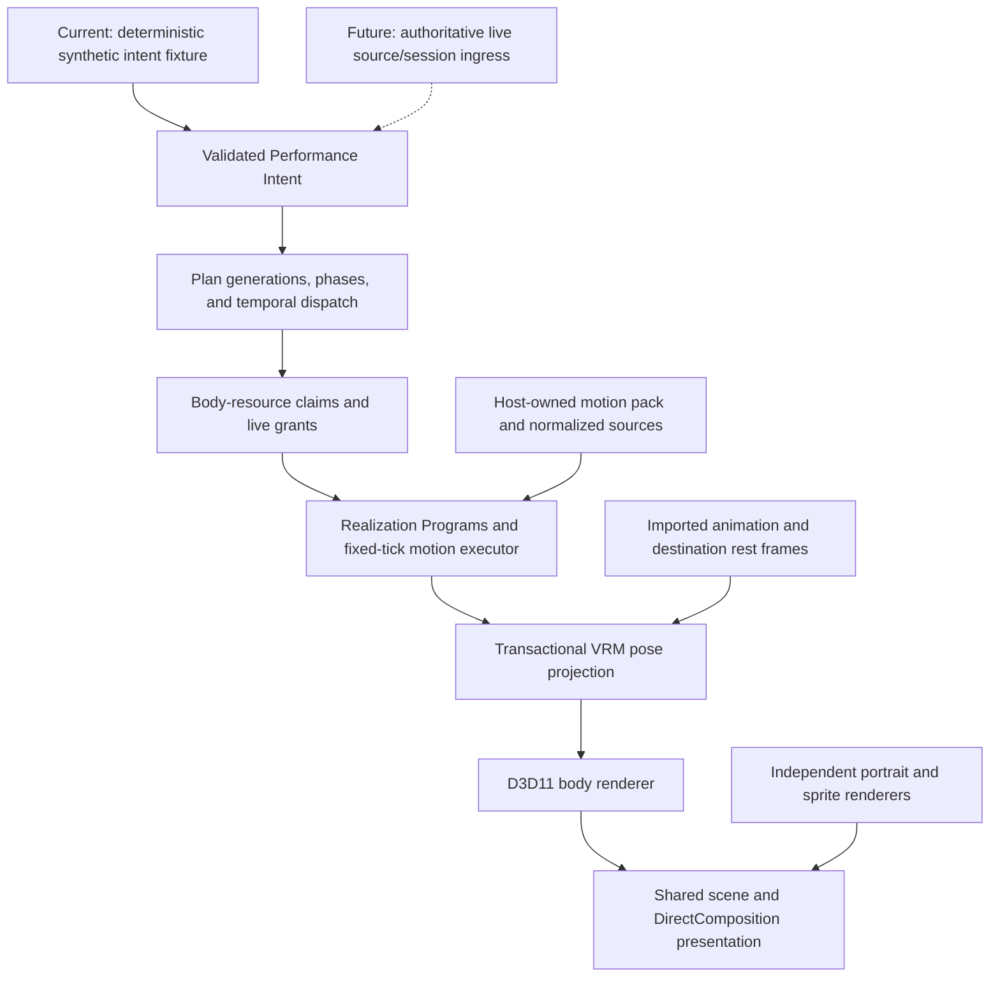

# EPR engineering walkthrough

EPR—the Eidolon Performance Runtime—is the active engineering focus of Eidolon. It is a C runtime
for coordinating character behavior over time, with a VRM body adapter and a native Windows host.
This page is a guided code review: what problem each layer solves, where it lives, and what proves
its behavior.

For precise completion status, read [project state](project-state.md). For normative ownership and
invariants, start with the [EPR overview](design/epr-overview.md).

## The problem

Playing a clip is straightforward. Keeping a character coherent when attention, posture, gestures,
and interruptions compete for the same joints is harder. A revised response must not restart an
already delivered gesture. A head turn must not erase posture. A malformed animation or impossible
arm target must not partially corrupt the visible rig.

Different avatars also have different authored rest rotations and proportions. Copying local
joint rotations or requiring a user to hand-author every semantic pose does not provide a reusable
motion system.

EPR separates behavior selection from normalized motion, destination-body adaptation, and pixels.
The current work replaces mandatory per-avatar pose authoring with shared animation and automatic
retargeting. Optional model-specific residual calibration remains an advanced repair tool.

## Boundaries



The dashed input is unfinished integration, not a second implemented EPR ingress. The diagram also
keeps the 2D bodies outside EPR: sharing native presentation does not require sharing animation
semantics.

## Decisions worth inspecting

### 1. Revision-safe behavior instead of a clip queue

Accepted intent carries explicit revision identity. The runtime compiles behavior phases and
dispatches them on integer logical ticks. Completed phases remain retired across interruption;
cleanup starts from current state instead of resetting to the start of a clip.

Read [performance_runtime.c](../src/epr/performance_runtime.c),
[behavior_plan.c](../src/epr/behavior_plan.c), and [temporal.c](../src/epr/temporal.c).
[performance_runtime_test.c](../tests/performance_runtime_test.c) covers complete-scenario
determinism, stale revisions, completed-gesture replay prevention, bounded history, and
interruption timing.

### 2. Ownership before blending

Posture, gaze, gestures, and procedural controllers make explicit resource claims. The motion
executor samples only eligible sources and intersects requested channels with declared source
coverage and actual sampled ownership. Absolute and additive motion have different semantics;
unowned channels remain untouched.

Read [body_resources.c](../src/epr/body_resources.c),
[motion_catalog.c](../src/epr/motion_catalog.c),
[motion_execution.c](../src/epr/motion_execution.c), and
[humanoid_pose.c](../src/humanoid_pose.c).
[epr_motion_execution_test.c](../tests/epr_motion_execution_test.c) and
[humanoid_pose_test.c](../tests/humanoid_pose_test.c) cover grant narrowing, layer order,
intensity-scaled residuals, quaternion blending, and rejected-frame rollback.

### 3. Normalize motion once; adapt to the destination body

The VRMA importer owns its tracks rather than borrowing temporary parser memory. It supports
STEP, LINEAR, and CUBICSPLINE sampling over a 55-role humanoid vocabulary. Source normalization and
destination retargeting share a rest-frame contract, including optional-role composition and
hips-height scaling. In-place root policy prevents animation displacement from moving the desktop
window.

Read [vrma_clip.c](../src/vrma_clip.c),
[vrma_motion_source.c](../src/vrma_motion_source.c),
[humanoid_rest.c](../src/humanoid_rest.c), and [vrm_retarget.c](../src/vrm_retarget.c).
[vrma_clip_test.c](../tests/vrma_clip_test.c),
[vrma_motion_source_test.c](../tests/vrma_motion_source_test.c), and
[vrm_retarget_test.c](../tests/vrm_retarget_test.c) cover interpolation, rest-space invariance,
optional bones, root policy, and atomic failure.

This is a tested supported subset, not evidence that every VRM or every deformation is correct.

### 4. Publish a whole pose or keep the last valid one

Projection composes imported base animation, normalized EPR motion, optional residuals, and
explicit procedural owners in scratch state. Gaze, expression, and weighted arm IK can survive
posture/gesture composition. Right-arm settling captures the outgoing local pose once per
behavior token; the pose and continuity state commit together.

A separate dynamic task-target stream validates producer revisions, current plan, exact behavior,
claim interval, finite bounds, and expiry before an arm target can affect the body.

Read [vrm_projection.c](../src/vrm_projection.c), [task_target.c](../src/epr/task_target.c), and
[vrm_playback.c](../src/vrm_playback.c).
[vrm_projection_test.c](../tests/vrm_projection_test.c) and
[performance_runtime_test.c](../tests/performance_runtime_test.c) exercise pose preservation,
retained-frame replay, procedural ownership, settle continuity, target expiry, and solve rollback.

### 5. Make ownership and provenance explicit at the asset boundary

The core catalog borrows immutable motion callbacks; a host-owned pack owns the actual clips.
Batch loading preflights every member, transfers ownership, rebases callbacks into stable storage,
and publishes only the complete valid catalog. A missing active semantic binding uses the explicit
controller fallback, never an unrelated clip under a convenient label.

Pinned idle/walk fixtures and a full conversation capture are reproducible from verified sources.
The review harness records time marks; the slice tool resolves exact BVH frames and records
provenance. Selecting a range, accepting the derived clip, labeling it, and binding it are separate
decisions.

Read [semantic_motion_pack.c](../src/semantic_motion_pack.c),
[bvh_to_vrma.py](../tools/bvh_to_vrma.py), and
[bvh_review_slice.py](../tools/bvh_review_slice.py).
[semantic_motion_pack_test.c](../tests/semantic_motion_pack_test.c) proves whole-batch rollback and
stable borrowed contexts. [bvh_review_slice_test.py](../tests/bvh_review_slice_test.py) covers strict
selection parsing and frame resolution. The [motion-pack contract](design/epr-motion-pack.md)
documents the authoring checkpoint.

### 6. Keep the native host independent—and inspect the actual hot path

Windows body rendering targets shared D3D11/DirectComposition surfaces. Presentation owns input
capture and target placement; EPR owns neither windows nor GPU state. The same native host can
switch between portrait, sprite, and VRM without merging their body-local state.

A visible review exposed poor cadence despite correct poses. The corrective work changed model
update eligibility from 33 ms to 16 ms, replaced linear keyframe searches with binary search, kept
the projected input mask at 128 × 128 instead of expanding it to 1024 × 1024, and made review tools
launch optimized builds by default. The owner subsequently accepted visible smoothness. These are
specific implementation changes, not a measured universal 60 FPS claim.

The compact mask is an approximation to projected mesh coverage, not pixel-perfect 3D transparency.
Input coordinates are mapped into its own dimensions; normal frames do not read the GPU framebuffer
back for hit testing.

Read [model.c](../src/model.c), [presentation.c](../src/presentation.c), and
[windows_dcomp.cpp](../src/platform/windows_dcomp.cpp).
[presentation_test.c](../tests/presentation_test.c) covers independent mask dimensions;
[test_body_host_windows.ps1](../tools/test_body_host_windows.ps1) exercises all-body switching,
native reconstruction, and SDL fallback.

## Reproduce the evidence

After the [Windows toolchain setup](development.md):

```powershell
gmake check
gmake epr-trace
gmake body-host-check
gmake MODE=release build/windows/bin/release/eidolon.exe
```

The ordinary suite includes EPR boundary checks, runtime/pose/catalog/execution tests, and
deterministic conversion fixtures. It does not need a private VRM or an inference model.
The trace command emits the synthetic five-second causal sequence without displaying a character.
The Windows body-host matrix uses debug-only test hooks and is separate from the ordinary suite.

For a locally supplied, permitted VRM 1.0 body, use the
[README animation commands](../README.md#try-automatic-animation-on-a-local-vrm). The hidden runtime
gate samples five seconds at 20 ms steps (251 samples), checks the real renderer path, and draws
hidden endpoint frames. It does not render 251 GPU frames or judge acting quality.

## Current frontier

R1–R3—import, retargeting, and model-owned playback—are implemented. The pinned idle and walk passed
sidecar-free hidden runtime checks and owner-visible review on the development reference body.
R4's composition, catalog, pack ownership, procedural refinement, and slice-authoring machinery
are implemented; its first bounded semantic gesture is not yet accepted or bound.

Remaining work includes the reviewed semantic vocabulary, wider body acceptance, dependable live
source/session-to-EPR integration, and a measured cross-machine resource budget. Full MToon,
authored look-at execution, spring bones, node constraints, contact/balance planning, and VRM 0.x
are not supported by this reference-body claim. Imported walk playback is not a locomotion planner.

The portrait remains the application default. EPR's prominence here does not imply a completed V1,
a change to the default body, or removal of the independent 2D runtime.
